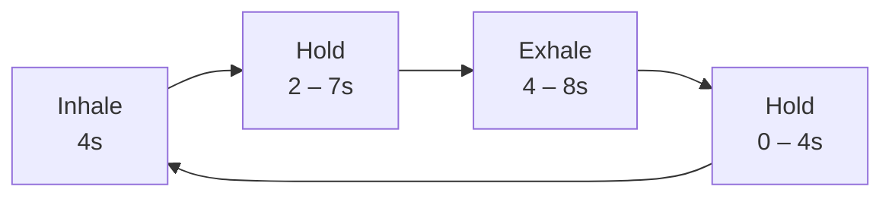

<div align="center">

# Breathe

[](https://soumendrak.github.io/breathe/)
[](LICENSE)
[](https://html.spec.whatwg.org/)
[](https://www.w3.org/TR/html52/)

<!-- Inline SVG logo: concentric breathing circle on dark background -->
<svg width="140" height="140" viewBox="0 0 140 140" xmlns="http://www.w3.org/2000/svg">
  <rect width="140" height="140" rx="24" fill="#0a0a14"/>
  <circle cx="70" cy="70" r="58" fill="none" stroke="#ff6b35" stroke-width="1.5" opacity="0.15"/>
  <circle cx="70" cy="70" r="48" fill="none" stroke="#ff6b35" stroke-width="2"   opacity="0.3"/>
  <circle cx="70" cy="70" r="36" fill="none" stroke="#ff6b35" stroke-width="2.5" opacity="0.55"/>
  <circle cx="70" cy="70" r="24" fill="none" stroke="#ff6b35" stroke-width="3"   opacity="0.75"/>
  <circle cx="70" cy="70" r="12" fill="#ff6b35" opacity="0.9"/>
</svg>

**A polished, single-file guided breathing exercise** — deployable anywhere, zero dependencies.

**Live:** [https://soumendrak.github.io/breathe/](https://soumendrak.github.io/breathe/)

</div>

---

## Features

- **Visual breathing guide** — an expanding and contracting circle leads your breath
- **Three breathing modes** to suit your needs (see below)
- **Real-time feedback** — phase name, countdown timer, session duration, cycle counter
- **Dark theme** with warm orange accent — easy on the eyes
- **Fully responsive** — works on desktop, tablet, and phone
- **Zero dependencies** — one HTML file, all CSS and JS inline
- **GitHub Pages ready** — just drop `index.html` into a repo

## Breathing Techniques

### 4-7-8 — Relaxing Breath
| Phase | Duration |
|-------|----------|
| Inhale | 4 seconds |
| Hold | 7 seconds |
| Exhale | 8 seconds |

Also known as the *relaxing breath*. The extended exhale activates the parasympathetic nervous system, promoting calm and helping with stress, anxiety, and sleep.

### 4-4-4 — Box Breathing
| Phase | Duration |
|-------|----------|
| Inhale | 4 seconds |
| Hold | 4 seconds |
| Exhale | 4 seconds |
| Hold | 4 seconds |

Used by Navy SEALs, first responders, and meditators. Each phase is equal length, creating a "square" pattern. Excellent for centering focus and managing acute stress.

### 4-2-4 — Energizing Breath
| Phase | Duration |
|-------|----------|
| Inhale | 4 seconds |
| Hold | 2 seconds |
| Exhale | 4 seconds |

A shorter hold keeps energy up while the longer inhale and exhale maintain rhythm. Great for a quick reset when you need focus without winding down.

## Breathing Cycle Flow



One full cycle comprises **inhale → hold → exhale → (optional) hold**, with durations varying by mode. The circle expands during inhale, stays expanded during the first hold, contracts during exhale, and stays contracted during the second hold (box breathing only).

## Usage

1. Open `index.html` in any modern browser
2. Select a breathing mode (4-7-8, 4-4-4, or 4-2-4)
3. Press **Start**
4. Follow the circle: watch it expand as you breathe in, hold as you pause, and contract as you breathe out

## File Structure

```
breathe/
├── index.html      # Single-file app (all markup, style, and logic)
├── README.md       # This file
└── LICENSE         # MIT
```

## Deploy on GitHub Pages

1. Fork or copy this repo
2. Push `index.html` to a repository named `breathe`
3. Go to **Settings → Pages** and select `main` branch as source
4. Your app will be live at `https://<username>.github.io/breathe/`

## License

**MIT** — use it freely, modify it, share it. See [LICENSE](LICENSE) for details.
